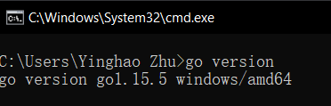
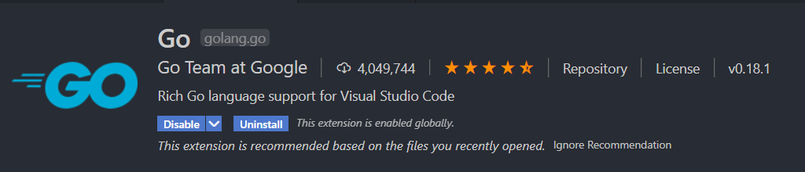
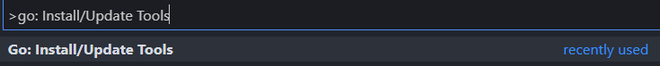

# Golang 后端环境配置

## Go

> Go is an open source programming language that makes it easy to build simple, reliable, and efficient software.

[菜鸟 Go 语言教程](https://www.runoob.com/go/go-tutorial.html)

[Download Go](https://golang.org/dl/)

### 检查环境

- 环境变量(应该已经配好了)


- 设置代理

在 cmd 中：

```go
go env -w GOPROXY=https://goproxy.cn,direct
```

- 检查 Go 是否安装成功(查看 go 版本)



## Goland

> GoLand is a cross-platform IDE built specially for Go developers

[Download Goland](https://www.jetbrains.com/go/)

要用的自行研究

### 使用 VS Code

- 安装插件 Go



- Ctrl+Shift+P 打开命令面板，输入 go: Install/Update tools，Press "Enter"



- 全选，Click "OK"


- Example: `hello.go`

```go
package main

import "fmt"

func main(){
    fmt.Println("Hello, World!")
}
```

- 在该文件的目录下，在 Terminal 中运行以下命令，可打印出`Hello, World!`：

```go
go run hello.go //其实是2步：go build hello.go + ./hello
```

## Gin

- 安装 Gin：在 Terminal 中，输入`go get -u -v github.com/gin-gonic/gin` (建议开 VPN)

  - `-v`：打印出被构建的代码包的名字
  - `-u`：已存在相关的代码包，强行更新代码包及其依赖包

- 创建一个 Gin Project (新建一个 Folder，如`gin-project`)
- 用 VS Code 打开该文件夹
- 在根目录下，创建`main.go`

```go
package main

import "github.com/gin-gonic/gin"

func main() {
	r := gin.Default()
	r.GET("/ping", func(c *gin.Context) {
		c.JSON(200, gin.H{
			"message": "pong",
		})

	})
	r.Run()
}
```

- 在根目录下通过以下命令：`go mod`来管理 Package

```go
go mod init gin-project
```

- 运行：`go run main.go`
- 浏览器中打开`localhost:8080/ping`可观察到返回到的 json 数据

**Note:**

- Go 中 package 的用法参见`go-project`的目录结构、`main.go`中的写法(`import`, `dao.New()`，大小写...)

## GORM

> Golang 写的，开发人员友好的 ORM 库

- 基础的连接 MySQL 的用法见 `main.go` in `gin-project` directory

```go
import (
	"github.com/jinzhu/gorm"
	_ "github.com/jinzhu/gorm/dialects/mysql"
)

func main() {
	db, err := gorm.Open("mysql",
		"root:@buaa21@tcp(101.132.227.56:3306)/test?charset=utf8&parseTime=True&loc=Local")
	db.SingularTable(true)
	if err != nil {
		fmt.Println(err)
		return
	} else {
		fmt.Println("connection succeeded")
	}
	defer db.Close()
}
```

如果能在 Terminal 中观察到`"connection succeeded"`，则表明 GORM 配置完成。
