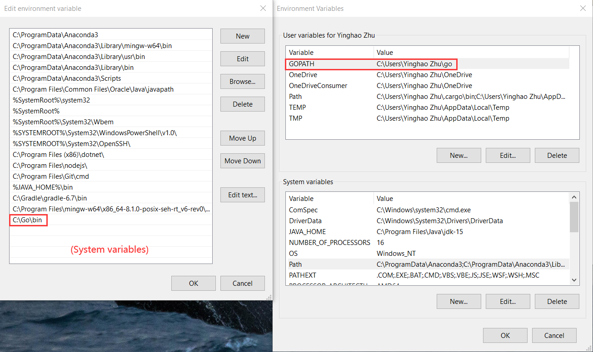
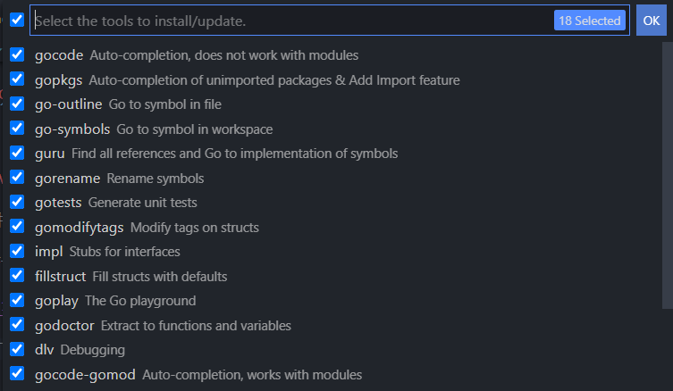

# Golang 后端环境配置
## Go

> Go is an open source programming language that makes it easy to build simple, reliable, and efficient software.

[菜鸟Go 语言教程](https://www.runoob.com/go/go-tutorial.html)

[Download Go](https://golang.org/dl/)

### 检查环境

- 环境变量(应该已经配好了)



- 设置代理

在cmd中：

```go
go env -w GOPROXY=https://goproxy.cn,direct
```

- 检查Go是否安装成功(查看go版本)


## Goland

> GoLand is a cross-platform IDE built specially for Go developers

[Download Goland](https://www.jetbrains.com/go/)

要用的自行研究

### 使用VS Code

- 安装插件Go
- Ctrl+Shift+P 打开命令面板，输入go:install/update tools，回车


全选，Click "OK"



- Example: `hello.go`

```go
package main

import "fmt"

func main(){
    fmt.Println("Hello, World!")
}
```

在该文件的目录下，在Terminal中运行以下命令，可打印出`Hello, World!`：

```go
go run hello.go //其实是2步：go build hello.go + ./hello
```

## Gin

安装 Gin：在Terminal中，输入`go get -u -v github.com/gin-gonic/gin` (建议开VPN)


- `-v`：打印出被构建的代码包的名字
- `-u`：已存在相关的代码包，强行更新代码包及其依赖包

- 创建一个Gin Project (新建一个Folder，如GinTest)
- 用VS Code打开该文件夹
- 在根目录下，创建`main.go`

```go
package main

import "github.com/gin-gonic/gin"

func main() {
	r := gin.Default()
	r.GET("/ping", func(c *gin.Context) {
		c.JSON(200, gin.H{
			"message": "pong",
		})

	})
	r.Run()
}
```

- 在根目录下通过以下命令：`go mod`来管理Package

```go
go mod init GinTest
```

- 运行：`go run main.go`
- 浏览器中打开`localhost:8080/ping`可观察到返回到的json数据

## GORM

> ORM