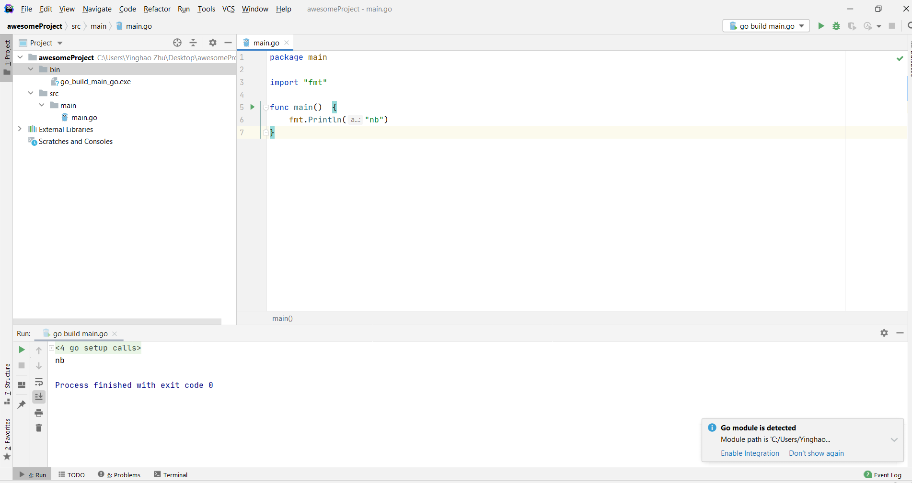

# Golang 后端环境配置

## Go

> Go is an open source programming language that makes it easy to build simple, reliable, and efficient software.

[Download Go](https://golang.org/dl/)

### 检查环境

- 环境变量(应该已经配好了)


- 设置代理

在cmd中：

```go
go env -w GOPROXY=https://goproxy.cn,direct`
```

- 检查Go是否安装成功


## Goland

> GoLand is a cross-platform IDE built specially for Go developers

[Download Goland](https://www.jetbrains.com/go/)

- Example: create a new project: "awesomeProject"

[Reference: 让你的Golang项目在IDE里跑起来](https://cloud.tencent.com/developer/article/1596713)



### 使用VS Code

（适合执行小文件。对于我们这个较大的后端项目，VS Code并不方便管理，不推荐）

- 安装插件Go

ctrl+shift+p 打开命令面板，输入go:install/update tools，回车


全选，Click "OK"


- Example: `hello.go`

```go
package main

import "fmt"

func main(){
    fmt.Println("Hello, World!")
}
```

在该文件的目录下，在Terminal中运行：

```go
go run hello.go
```

## Gin

## GORM

> ORM