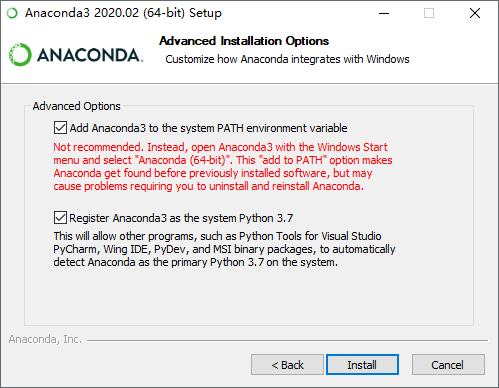
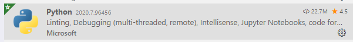
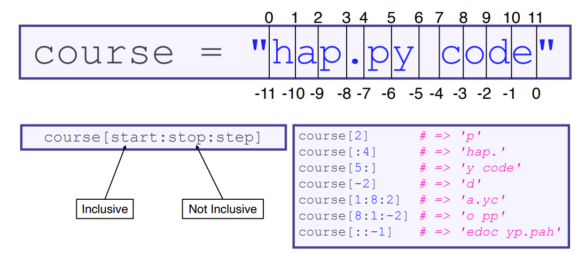

# Python Basics #1

## 0 The Zen of Python

```python
>>> import this
```

## 1 环境搭建

### Anaconda

选用Anaconda作为系统的Python环境

- Anaconda对R、Python均有比较好的支持
- 内置了很多非常实用的数据处理、统计等相关的包

[下载安装64位Python3版本Anaconda](https://www.anaconda.com/products/individual)

**Note:**

- 安装过程中选择Install for All Users
- Advanced Options都选上



### VS Code

VS Code非常好用，轻量、美观、功能强大

[下载安装稳定版](https://code.visualstudio.com/)

新建一个Python文件后，会提示安装Python插件，装上即可



## 2 怎么运行

- click右上角的三角


## 3 Comments 注释

```python
# A single-line comment in Python is denoted with the hash symbol.

"""
Multi-line comments
Lie between quotation marks
This is a haiku
"""
```

## 4 Variables 变量

```python
x = 5 # x is of type int
x = "Hello," # x is now of type str
print(x + " World!")
```

- 变量命名有要求，区分大小写

## 5 Types 数据类型

- Python has only three numeric types: float, int, and complex.

| 示例              | 数据类型     | 备注      |
| ----------------- | ------------ | --------- |
| x = "Hello World" | str 字符串   |           |
| x = 29            | int 整数     | 长度不限  |
| x = 29.5, x=27e3  | float 浮点数 |           |
| x = 1j            | complex 复数 | j作为虚部 |
| ...               |              |           |

- 设置为指定的数据类型

```python
x=str("hello")
y=int(100)
```

- Python is dynamically typed. Variables don’t have a type, but objects do!

```python
michael = 22
type(michael) # => int

michael = 'Lecturer, Canadian'
type(michael) # => str
```

## 6 Strings 字符串

- Python doesn’t have an explicit char type. Instead, chars are strings with length 1.
- Both " ... " and ' ... ' define string literals.
- Python strings are Unicode by default (yes – this means we can use emoji in Python strings! ! )
- You can only concatenate strings with strings! If x is an integer, it must be cast as a string (str(x)) before being concatenated with another string.



```python
a = "Hello, World"
a += "!"
print(a)
print(a[1]) # 字符串是字节数组
print(a[2:5]) # 获取从位置 2 到位置 5（不包括）的字符
print(len(a)) # 返回字符串的长度
```

## 7 Booleans

```python
print(8 > 7) # True
print(8 == 7) # False
print(8 < 7) # False

# All objects in Python are either "truthy" or "falsy", meaning when cast
# as booleans, they evaluate to either True or False.
# Zero values and empty data structures are "falsy"

>>> bool(None) # => False
>>> bool(False) # => False
>>> bool(0) # => False
>>> bool(0.0) # => False
>>> bool("") # => False
>>> bool([]) # => False

# Everything else is "truthy"!
>>> bool(42) # => True
>>> bool("Sam Redmond") # => True
>>> bool([1, 2, 3]) # => True

# Quiz - is the following "truthy" or "falsy"?
>>> bool([False]) # => True
```

## 8 运算符

| 算术运算符 | 名称             | 实例   |
| ---------- | ---------------- | ------ |
| +          | 加               | x + y  |
| -          | 减               | x - y  |
| *          | 乘               | x * y  |
| /          | 除               | x / y  |
| %          | 取模             | x % y  |
| **         | 幂               | x ** y |
| //         | 地板除（取整除） | x // y |

| 赋值运算符 | 实例   | 等同于    |
| ---------- | ------ | --------- |
| =          | x = 5  | x = 5     |
| +=         | x += 3 | x = x + 3 |
| -=         | x -= 3 | x = x - 3 |
| *=         | x *= 3 | x = x * 3 |

| 比较运算符 | 名称       | 实例   |
| ---------- | ---------- | ------ |
| ==         | 等于       | x == y |
| !=         | 不等于     | x != y |
| >          | 大于       | x > y  |
| <          | 小于       | x < y  |
| >=         | 大于或等于 | x >= y |
| <=         | 小于或等于 | x <= y |

| 逻辑运算符 | 描述                                    |
| ---------- | --------------------------------------- |
| and        | 如果两个语句都为真，则返回 True       |
| or         | 如果其中一个语句为真，则返回 True     |
| not        | 反转结果，如果结果为 True，则返回 False |

## 9 Lists 列表

- 列表是一个有序且可更改的集合。在 Python 中，列表用方括号编写。

```python
# Create a new list
empty = []
thislist = ["apple", "banana", "cherry"]
numbers = [1, 2, 3]

# Lists can contain elements of different types (even other lists!)
many_types = ["a", 2, 3, [4, 5]]
# Quick – what is many_types[3]?
# [4, 5]
# Follow up – what is many_types[3][1]?
# 4

print(thislist)
print(thislist[1]) # banana 计数从0开始
for x in thislist: # 遍历
  print(x)
if "apple" in thislist: # 判定存在
  print("Yes, 'apple' is in the fruits list")
thislist.append("orange") # 向末尾添加元素

num=[1,2,3]
num.extend([4,5]) # [1,2,3,4,5]
# num.append([4,5]) # [1, 2, 3, [4, 5]]
```

## 10 Tuples 元组

- 元组是有序且不可更改的集合。在 Python 中，元组是用圆括号编写的。

```python
thistuple = ("apple", "banana", "cherry")
```

## 11 Sets 集合

- 集合是无序和无索引的集合。在 Python 中，集合用花括号编写。

```python
thisset = {"apple", "banana", "cherry"}
```

## 12 Dictionaries 字典

- 字典是一个无序、可变和有索引的集合。在 Python 中，字典用花括号编写，拥有键(key)和值(value)。

```python
thisdict =	{
  "brand": "Porsche",
  "model": "911",
  "year": 1963
}
print(thisdict)
```

## 13 Conditional Statements

- Both `elif` and `else` are optional.
- Python has no `switch` statement, instead preferring `if/elif/else` chains.

```python
a = 200
b = 66
c = 500
if a > b or a > c:
  print("At least one of the conditions is True") # 注意缩进

#---if elif---#
a = 66
b = 66
if b > a:
  print("b is greater than a")
elif a == b: # (else if)
  print("a and b are equal")

#---if elif else---#
a = 200
b = 66
if b > a:
  print("b is greater than a")
elif a == b:
  print("a and b are equal")
else:
  print("a is greater than b")

#---if else---#
a = 200
b = 66
if b > a:
  print("b is greater than a")
else:
  print("b is not greater than a")
```

## 14 Loops

- While loops are very similar to other languages: 

```python
while condition:
  do_action()
```

- For loops are over some collection of items…

```python
for item in collection:
  do_action_on(item)
```

- …which can be a range object, producing C++/Java-like loops.

```python
for i in range(start, stop, step):
  use_number(i)
```

**Example:**

```python
i = 1
while i < 7:
  print(i)
  i += 1

i = 1
while i < 7:
  print(i)
  if i == 3:
    break # 控制循环跳出 (还有continue停止当前迭代，继续下一个)
  i += 1

fruits = ["apple", "banana", "cherry"]
for x in fruits:
  print(x)

for x in range(10):
  print(x) # print 0到9

for x in range(3, 10):
  print(x) # print 3到9 默认++1

for x in range(3, 50, 6):
  print(x) # print 3 9 15... 步长为6
```

## 15 Functions 函数

- The `def` keyword defines a function.
- Parameters do not have explicit types (unlike C, C++, Java).
- `return` is optional. If either return or its value are omitted, it implicitly returns `None`.

```python
# 没有参数
def my_function():
  print("Hello from a function")
my_function() # 调用函数

# 传了一个参
def my_function(fname):
  print(fname + " Gates")
my_function("Rory John")

# 传参，带返回值
def my_function(x):
  return 5 * x
print(my_function(3))
```

## 16 Arrays 数组

- Python中默认不支持数组
- 导入numpy包，可支持数组

```python
import numpy as np # np作为缩写
v = 10
INF = 1e3
# 建数组
used = np.zeros(v, dtype=int) # 长度为v，初始化全为0的数组
distance = np.zeros(v, dtype=int)
cost = np.zeros((v, v), dtype=int) # 建二维数组
# 初始化数组
for i in range(0, v, 1): # 0, 1, ... 9，步长为1
    distance[i] = INF
for i in range(0, v, 1):
    for j in range(0, v, 1):
        cost[i, j] = INF # 对二维数组赋值，嵌套循环，先j+，j加至9后，i+1，直至i=9
```

## 17 Console I/O

- input prompts for input from the terminal

```python
>>> name = input("What is your name? ")
What is your name? Unicorn

>>> print("Nice to meet you, ", name)
Nice to meet you, Unicorn
```

## Python 能做啥

以上是最基础的Python的一些用法，任何一门语言基本都有的（数据类型、判断、循环、函数...）。还有很多东西没整理，比如怎么调试debug、文件处理、面向对象、更多的自带function等

不过就我的理解，所有的程序无非也就是赋值、判断和循环（到汇编语言里很本质的那一层，基本就只剩了这么些东西，再本质就0101001了）

而所有的算法题基本就是上面这些东西的排列组合，也蛮奇妙的

说回Python，其强大之处当然不是因为这些，是因为其有非常多的库（现成的轮子）可以调用，在很多领域有很多人在用它、为它造轮子...

如统计、数学、爬虫、Web框架、机器学习、人工智能......

（缺点当然也有，速度慢什么的）