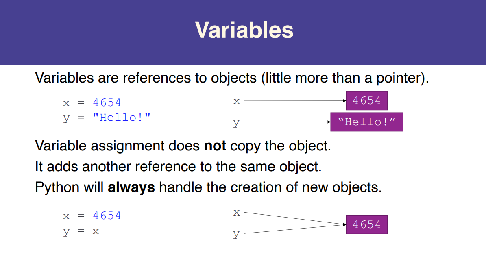

# Python Basics #2

## The Data Model

### Objects

**Everything is an object!** (和Java一样，Python中亦是万物皆对象。Python是一门可以面向对象的语言，C语言不是，C语言单纯面向过程)

```python
# >>> help(isinstance)
# isinstance(obj, class_or_tuple, /)
#    Return whether an object is an instance of a class or of a subclass thereof.
#
#    A tuple, as in ``isinstance(x, (A, B, ...))``, may be given as the target to
#    check against. This is equivalent to ``isinstance(x, A) or isinstance(x, B)
#    or ...`` etc.

isinstance(4, object) # => True
isinstance("Michael", object) # => True
isinstance([4, 5, 'seconds'], object) # => True
isinstance(None, object) # => True
isinstance(str, object) # => True
isinstance(object, object) # => True
```
- Objects have identity, type, and value
- Variables are un-typed (dynamically typed) (Python是一门使用[Duck Typing](https://zh.wikipedia.org/wiki/鸭子类型)鸭子类型的语言，动态类型的语言风格有利有弊)

The type determines what can be done to an object (e.g., does it have a length?)

```python
type("unicorn") # => str
type(1) # => int
type(3.0) # => float
```

Types are also objects!

```python
isinstance(type('unicorn'), object) # => True
```

### Variables



## Strings, Revisited

### Special Characters

- 一些特殊字符，如`'`、`"`等需要通过`\`来进行转义
  - `print('')`时，对`'`转义
  - `print("")`时，对`"`转义

```python
print('doesn\'t') # => doesn't
print("doesn't") # => doesn't
print('"Yes," he said.') # => "Yes," he said.
print("\"Yes,\" he said.") # => "Yes," he said.
print('"It isn\'t," she said.') # => "It isn't," she said.
```

### Useful String Methods

```python
greeting = "Hello! Love, unicorn. "

greeting[4] # => 'o'
'corn' in greeting # => True
len(greeting) # => 23
greeting.find('lo') # => 3 (-1 if not found)
greeting.replace('ello','iya') # => Hiya! Love, Unicorn.
greeting.startswith('Hell') # => True
greeting.endswith(' ') # => True
greeting.isalpha() # => False

greeting.lower() # => 'hello! love, unicorn.'
greeting.title() # => 'Hello! Love, Unicorn.'
greeting.upper() # => 'HELLO! LOVE, UNICORN.'

# str.strip(chars) -> str
# Return a copy of the string with leading and trailing whitespace removed.
# If chars is given and not None, remove characters in chars instead.
greeting.strip() # => 'Hello! Love, unicorn.'
greeting.strip('.nrH ') # => 'ello! Love, unico'
```

### Lists <—> Strings

```python
list('Hair toss!')
# => ['H', 'a', 'i', 'r', ' ', 't', 'o', 's', 's', '!']

# `.split` partitions by a delimiter...
'ham cheese bacon'.split()
# => ['ham', 'cheese', 'bacon']

# ...which can be specified, but defaults to whitespace
'3-14-2015'.split(sep='-')
# => ['3', '14', '2015']

# `.join` creates a string from a list of strings
', '.join(['Zheng', 'Antonio', 'Sam'])
# => 'Zheng, Antonio, Sam'
```

### String Formatting

- 用以格式化输出

```python
# Curly braces are placeholders
'{} {}'.format('beautiful', 'unicorn') # => 'beautiful unicorn'

# Provide values by position or placeholder
'{0} can be {1} {0}, even in summer!'.format('snowmen', 'frozen’)
# => 'snowmen can be frozen snowmen, even in summer!'

'{name} loves {food}'.format(name='Michael', food='applesauce')
# => 'Michael loves applesauce' (he does)

# Values are converted to strings
'{} squared is {}'.format(5, 5**2) # => '5 squared is 25'

# You can use C-style specifiers too!
"{:06.2f}".format(3.14159) # => '003.14'

# Padding can be specified as well.
'{:10}'.format('left') # => 'left      '
'{:*^12}'.format('CS41') # => '****CS41****'

# You can even look up values!
captains = ['Kirk', 'Picard']
"{caps[0]} > {caps[1]}".format(caps=captains)

# String concatenation with +
"I am " + str(age) + " years old."

# Formatted string literals (only on Python 3.6+)
f"I am {age} years old."
f"{', '.join(['Zheng', 'Antonio', 'Sam'])} are awesome!"
```

## File I/O

### A Motivating Example

```python
f = open("knights.txt","r") # 以只读模式打开该文件
for line in f:
    data = line.split()

    name = data[0]
    wins = int(data[1])
    losses = int(data[2])

    win_percent = 100 * wins / (wins + losses)
    print(f"{name}: Wins {win_percent:.2f}%")
    # .2f是C-Style的格式化输出方法
    # 表示win_percent作为float，输出的值保留到小数点后两位
    # Lancelot: Wins 100.00%
    # Galahad: Wins 36.84%
    # Geraint: Wins 75.00%
f.close() # 文件打开后必须要正常关闭
```

Content of `knights.txt`:

```
Lancelot 6 0
Galahad 7 12
Geraint 3 1
Mordred 0 0
```

Something goes wrong…

```python
f = open("file.txt", "r")
print(1 / 0) # Crash! 运行到此处，出现ZeroDivisionError，程序中断
f.close() # Never executes!
```

We never close the file! That’s bad!

```python
with open("file.txt", "r") as f:
    content = f.read()
    print(1 / 0)
```

- `with expr as var` ensures that `expr` will be “entered” and “exited” regardless of the code block execution

**Revised Version:**

```python
with open("knights.txt","r") as f:
    for line in f:
        data = line.split()

        name = data[0]
        wins = int(data[1])
        losses = int(data[2])

        win_percent = 100 * wins / (wins + losses)
        print(f"{name}: Wins {win_percent:.2f}%")
```

## Modules

### Using Modules

```python
# Import a module.
import math
math.sqrt(16) # => 4.0

# Import specific symbols from a module (though we usually import
# the entire module).
from math import ceil, floor
ceil(3.7) # => 4.0
floor(3.7) # => 3.0

# Bind module symbols to a new symbol in the local namespace.
from some_module import super_long_symbol_name as short_symbol
import why_did_anyone_name_a_module_this_long as short_module

# *Any* python file (including those you write) is a module.
from my_file import my_fn, my_variable
```