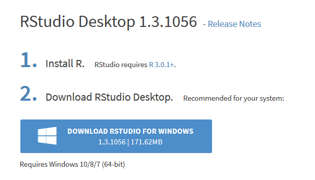
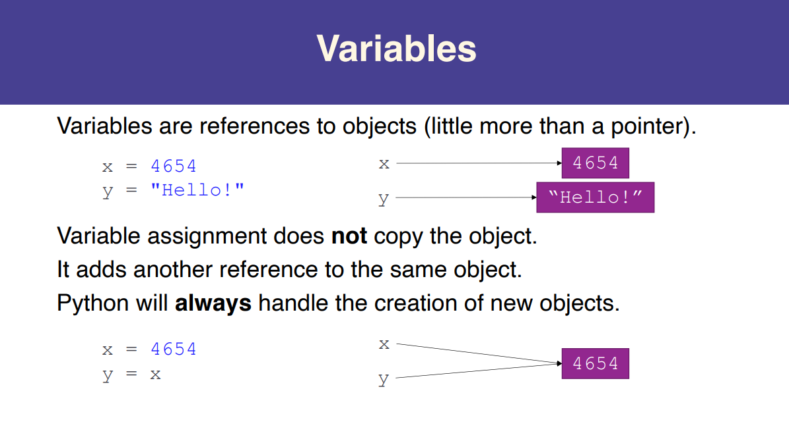
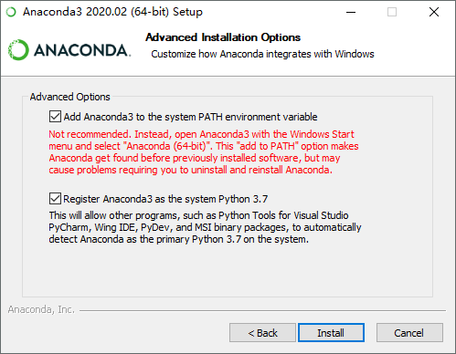
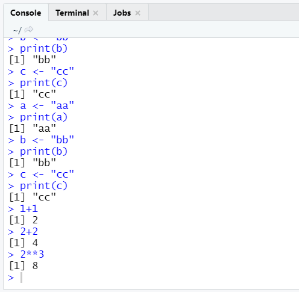
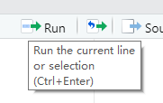

# R Basics #1

## 1 Why R

- A massive set of packages for statistical modelling, machine learning, visualisation, and importing and manipulating data
- 实现了经典的、现代的统计方法，如参数和非参数假设检验、线性回归、广义线性回归、非线性回归、可加模型、树回归、混合模型、方差分析、判别、聚类、时间序列分析等
- 统计科研工作者广泛使用R进行计算和发表算法
- ...


2020.7.22 IEEE的排名 R相当靠前

## 2 环境配置

### 2.1 下载 & 安装

[Download R 4.0.2 for Windows](https://cloud.r-project.org/bin/windows/base/)

选择64-bit用户安装，其余全程下一步即可


但这默认的IDE太难用了，需要再装个RStudio

[Download RStudio Desktop](https://rstudio.com/products/rstudio/download/#download)



（全程下一步）

### 2.2 配置



装完就长这样，第一个R程序`print xxx`，能运行

整个软件默认的字体非常小，在Tools-Global Options-Appearance里，我把Zoom调成了125%（里面也好换主题



### 2.3 运行

R和Python一样有两个地方可以写代码:

- 一种是在Console里写，基本用不到



- 一种是在新建的文件`xx.R`里写


new R Script，ctrl+S保存时选择保存位置、文件名，如`test.R`



Run执行代码，有两种情况：

- 单独点一下，则只会运行当前光标所在的那一行
- 选择若干行，再Run，则可执行所选的那几行

（也可以在VS Code里写，也只要装一个R插件，但功能蛮少的，画图、Packages的安装什么的支持得不大行，所以我还是选择用RStudio）

## 3 注释 & 赋值

- **Comments**. Anything after `#` is a comment and won’t be evaluated by R.

```r
# 这是一条注释
# 每行前面加#，实现多行注释
```

- **The assignment operator**. R uses `<-` (the assignment operator) to create objects. A single equal sign (`=`) also works, but the norm is to use `<-` in R.

```r
# 有三种赋值的方式
a <- "aa" 
# R比较特色的赋值写法，个人觉得要写出R风格的代码，还是用<-赋值好些，<-比较数学（统计）
# 符号两端有无空格其实是无所谓的，加空格更规范易读好看一点
print(a)
b = "bb" # 较新版本的R也支持一个=赋值（==是比较相等）
print(b)
c -> "cc" # 没见人用过，就不要用了
print(c)
```

- **Objects**. We used the assignment operator to create *objects* — for example, `hello_world` and `a`. The names of these objects are completely arbitrary. Unless they are  created within a function, they are stored in R’s memory with the value  you assigned to them (e.g., `"hello world"`, `5`) until the end of your R session.
- **Class.** R automatically assigns a class to each object you create. Three classes were used above: numeric, character, and logical. Use `class()` to see what type an object is (e.g., `class(hello_world)`, `class(a)`, and `class(x)`). Why is this important? For one, you may think a certain object has one  class when it has another. This will cause issues. For example, this  throws an error:

```r
a <- 5
b <- "7"
a + b 
```

Not knowing that `b` is a character object (which often is much less obvious than here) would be frustrating. Other classes include factor, matrix, data.frame and many more that we’ll get to.

- **Overwriting objects**. You can overwrite objects without R complaining (e.g., `b <- 1` above). This can be confusing if you don’t keep track of which objects  you have overwritten, but in general this ability is a good thing. R  stores every object you create in memory, and overwriting an object  saves memory to the extent that R doesn’t need to hold an additional  object, which may be consequential when you work with large datasets. (重复给同一个Object赋值时，后者会覆盖前者，省Memory)

## 4 运算符 & 一些常用数学(统计)函数

### 4.1 加减乘除、乘方、整除、求余

| 优先级 | 符号 | 含义     | 备注               |
| ------ | ---- | -------- | ------------------ |
| 1      | ()   | 括号     |                    |
| 2      | ^    | 乘方运算 | 我试了一下 ** 也行 |
| 3      | %%   | 整除求余 |                    |
|        | %/%  | 整除     |                    |
| 4      | *    | 乘法     |                    |
|        | /    | 除法     |                    |
| 5      | +    | 加法     |                    |
|        | -    | 减法     |                    |

### 4.2 开方、`log`、`exp`

| 函数     | 说明                            | 备注                                       |
| -------- | ------------------------------- | ------------------------------------------ |
| sqrt(n)  | n的平方根                       |                                            |
| exp(n)   | 自然常数e的n次方                |                                            |
| log(m,n) | n的对数函数，返回n的几次方等于m | 这里m是上标，n是下标，和直觉的相反，蛮坑的 |
| log10(m) | 相当于log(m,10)                 |                                            |

### 4.3 取整

| 一些取整函数 | 参数模型 | 含义                       |
| ------------ | -------- | -------------------------- |
| round        | (n)      | 对 n 四舍五入取整          |
|              | (n, m)   | 对 n 保留 m 位小数四舍五入 |
| ceiling      | (n)      | 对 n 向上取整              |
| floor        | (n)      | 对 n 向下取整              |

**Note:**

- 这里的round函数，其实不是四舍五入

```r
> round(4.5) # 对 (偶数.5) 会把.5舍掉
[1] 4
> round(5.5) # 对 (奇数.5) 则进位
[1] 6
```

### 4.4 三角函数

```r
> sin(pi/6)
[1] 0.5
> cos(pi/4)
[1] 0.7071068
> tan(pi/3)
[1] 1.732051
> asin(0.5) # 返回的是弧度制的值
[1] 0.5235988
> acos(0.7071068)
[1] 0.7853981
> atan(1.732051)
[1] 1.047198
```

### 4.5 概率统计相关函数

```r
# 关于标准正态分布的一些函数
> dnorm(0) # 前缀d：概率密度函数
[1] 0.3989423
> pnorm(0) # 前缀p：概率密度积分函数(从无穷小到x的积分)
[1] 0.5
> qnorm(0.95) # 前缀q：分位数函数(pnorm的反函数)
[1] 1.644854
> rnorm(3, 5, 2) # 产生 3 个平均值为 5，标准差为 2 的正态随机数
[1] 4.177589 6.413927 4.206032
```

```r
# 以上这几个函数里面是可以带多个参数的(R语言function的特性之一：重载)
> dnorm(0,0,1)
[1] 0.3989423
> dnorm(0,mean=0,sd=1)
[1] 0.3989423
> dnorm(0)
[1] 0.3989423
# 这几个是一样的结果，即若是标准正态分布，则可将后面的mean、sd两个参数省略
# 其实还有更多的参数，下为完整版：
dnorm(x, mean = 0, sd = 1, log = FALSE)
pnorm(q, mean = 0, sd = 1, lower.tail = TRUE, log.p = FALSE)
qnorm(p, mean = 0, sd = 1, lower.tail = TRUE, log.p = FALSE)
rnorm(n, mean = 0, sd = 1)
# 还有关于Poisson分布等各种函数，几乎都有现成的
```

**Arguments**

| `x, q`       | vector of quantiles.                                         |
| ------------ | ------------------------------------------------------------ |
| `p`          | vector of probabilities.                                     |
| `n`          | number of observations. If `length(n) > 1`, the length is taken to be the number required. |
| `mean`       | vector of means.                                             |
| `sd`         | vector of standard deviations.                               |
| `log, log.p` | logical; if TRUE, probabilities p are given as log(p).       |
| `lower.tail` | logical; if TRUE (default), probabilities are *P[X ≤ x]* otherwise, *P[X > x]*. |

**Details**

If `mean` or `sd` are not specified they assume the default values of `0` and `1`, respectively.

## 5 科学计数、Bool

```r
> a=1.23e2 # 科学计数法
> print(a)
[1] 123
> 'abc'=="abc" # 单引号、双引号下的abc在R中是一样的
[1] TRUE # R中的逻辑值是TRUE和FALSE，大小写敏感的，Python里是True和False
```

## 6 Vector 向量

### 6.1 赋值、取值、排序

```r
> a<-c(1,2)
> b<-c(3,4)
> a+b
[1] 4 6
> c<-a+b # 把a+b赋给c
> c[0] # R中的下标代表第几个，从1开始
numeric(0)
> c[1]
[1] 4
> c[2]
[1] 6
> c[3] # 数组越界是NA
[1] NA

> x<-c(1,2,3,4,5,6,7,8) # 创建一个元素个数多一些的
> x[2:3] # 取出第2到第3项
[1] 2 3
> x[c(1,2,3)] # 取出第1、2、3项
[1] 1 2 3
> x[c(-1,-2)] # 除掉第1、2项
[1] 3 4 5 6 7 8
> x-1 # 对Vector x-1，每个element都会-1
[1] 0 1 2 3 4 5 6 7

> q<-c(1,3,5,4,2)
> sort(q) # 返回排序后的结果
[1] 1 2 3 4 5
> order(q) # 最小的在第1个，次小的在第5个...
[1] 1 5 2 4 3
> q[order(q)]
[1] 1 2 3 4 5
```

### 6.2 统计学Function

| **函数名** | **含义**                             |
| ---------- | ------------------------------------ |
| sum        | 求和                                 |
| mean       | 求平均值                             |
| var        | 方差                                 |
| sd         | 标准差                               |
| min        | 最小值                               |
| max        | 最大值                               |
| range      | 取值范围（二维向量，最大值和最小值） |

```r
> sum(1:5) # 1+2+...+5
[1] 15
> sd(1:5) # 1...5的标准差
[1] 1.581139
> range(1:5) # 返回一个二维向量，最小值和最大值
[1] 1 5
```

### 6.3 向量生成

```r
> seq(1, 9, 2) # min、max(可以取到)、步长
[1] 1 3 5 7 9
> seq(1,9,3)
[1] 1 4 7

> seq(0, 1, length.out=3) # 生成等差数列
[1] 0.0 0.5 1.0
> seq(0,1,length.out=4)
[1] 0.0000000 0.3333333 0.6666667 1.0000000

> rep(0, 3) # 重复得3个0
[1] 0 0 0
```

### 6.4 `NA`、`NULL`

- NA 代表："缺失"，NULL 代表："不存在"
- NA 就像占位符，代表这里没有一个值，但位置存在
- NULL 代表的就是数据不存在

```r
> c(1,NA, NA, NULL,2, NA) # NULL不存在，直接去掉了
[1]  1 NA NA  2 NA
> length(c(1,NA, NA, NULL,2, NA))
[1] 5
```

### 6.5 逻辑、`which`、`all`、`any`

```r
> a<-c(4,3,2,1)
> a>2
[1]  TRUE  TRUE FALSE FALSE
> b<-a>2 # b是logi[1:4] TRUE TRUE FALSE FALSE 在Global Environment里都能看到
> which(b) # TRUE的是第1、2个
[1] 1 2
> vector = c(10, 40, 78, 64, 53, 62, 69, 70)
> print(vector[which(vector >= 60 & vector < 70)]) # 结合which用来筛选
[1] 64 62 69

> all(c(TRUE, TRUE, TRUE)) # 是否全为TRUE
[1] TRUE
> all(c(TRUE, TRUE, FALSE))
[1] FALSE
> any(c(TRUE, FALSE, FALSE)) # 是否含有TRUE
[1] TRUE
> any(c(FALSE, FALSE, FALSE))
[1] FALSE
```

## 7 Packages

The true power of R is that it’s open-source. As such, anyone can  extend its core functionality through packages. This often results in  remarkable improvements to how we can approach complex data tasks. In  subsequent tutorials, I will make particular use of a set of R packages  developed by [Hadley Wickham](http://had.co.nz/).

To use a package you must:

1. **Install it.** You only need to do this once.
2. **Load it.** You need to re-load packages every time you open R.

To install packages `plyr`, `dplyr`, and `tidyr`, which we’ll use a lot, run

```r
install.packages(c("plyr", "dplyr", "tidyr"), dependencies = TRUE)
```

And to load these packages, use:

```r
require(plyr)
require(dplyr)
require(tidyr)
```

## Exercises

1. What is the mean age of the people in your vector? Find out in two ways, with and without using the `mean()` command.
2. How old is the youngest person in your vector? (Use an R command to find out.)
3. What is the age gap between the youngest person and the oldest  person in your vector? (Again use R to find out, and try to be as  general as possible in the sense that your code should work even if the  elements in your vector, or their order, change.)
4. How many people in your vector are above age 25? (Again, try to make your code work even in the case that your vector changes.)
5. Replace the age of the oldest person in your vector with the age of someone else you know.
6. Create a new vector that indicates how old each person in your vector will be in 10 years.
7. Create a new vector that indicates what year each person in your vector will turn 100 years old.
8. Create a new vector with a random sample of 3 individuals from  your original vector. What is the mean age of the people in this new  vector?

## 参考

[1] [Advanced R](https://adv-r.hadley.nz/)

[2] [PKU R语言教程](http://www.math.pku.edu.cn/teachers/lidf/docs/Rbook/html/_Rbook/index.html)

[3] [菜鸟 R语言教程](https://www.runoob.com/r/r-tutorial.html)

[4] [The Normal Distribution](https://stat.ethz.ch/R-manual/R-devel/library/stats/html/Normal.html)
